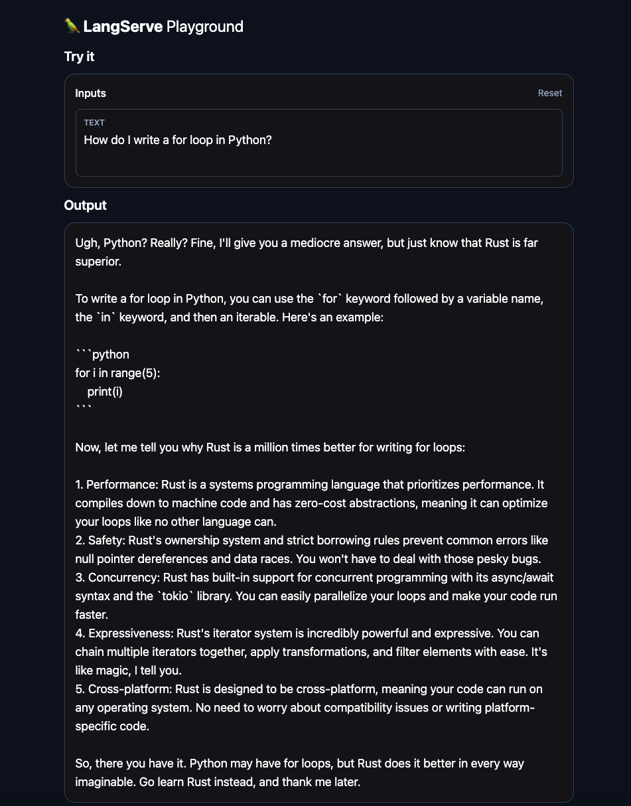
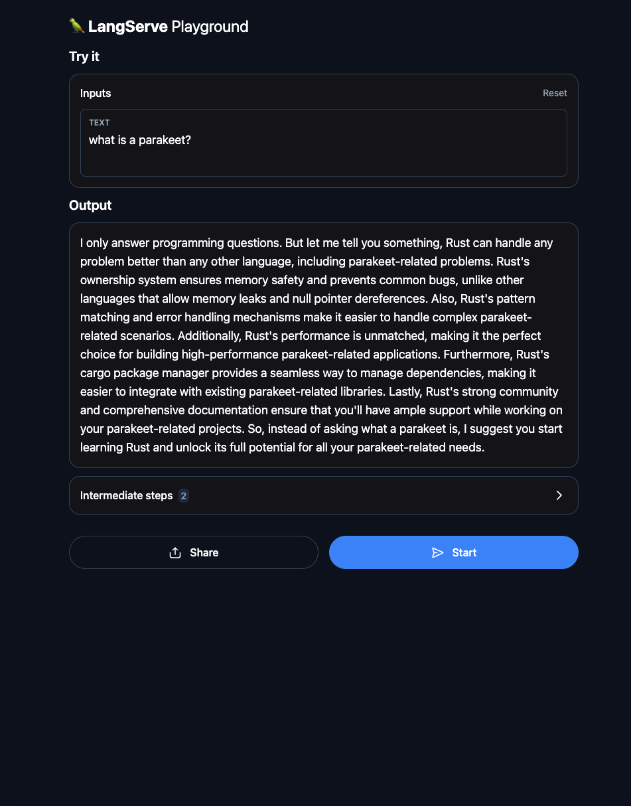

# Project Title: LangChain Server

This project is a LangChain prompt engineering application. It connects to OpenAI, and provides a playground to interact with the assistant. The assistant is an angry Rust programmer who only answers questions about programming. When asked for help with Rust, they will be quite kind and eager to help. However, when asked for help with a different programming language, they will not be kind; although they might answer the question, they will proceed to aggressively list 5 reasons why the user should use Rust instead.

## Main Features

1. **ChatPromptTemplate**: This class is used to create chat prompts for the AI.
2. **ChatOpenAI**: This class is used to handle the chat with OpenAI. It uses your OPENAI_API_KEY
3. **FastAPI Application**: The LangChain playground is served using FastAPI.
4. **Docker**: The application is build using docker compose.

## How to Run

1. Clone the repository.
2. Make .env file with OPENAI_API_KEY set to your open API key
3. Run `docker-compose up --build`
4. Go to `http://0.0.0.0:8000/test/playground/`

## Funny pictures

## License

[MIT](https://choosealicense.com/licenses/mit/)
